# 🏥 M-Health — Smart Mobile Healthcare & Edge AI System

<p align="center">
  
  
  
  
  
  
  
  
</p>

---

> **M-Health** is a comprehensive, native Android application engineered to unify clinical workflows, patient engagement, and intelligent on-device medical triage. Featuring a multi-role architecture (Admin, Doctor, Secretary, Patient), offline-first SQLite persistence, embedded deep learning (TensorFlow Lite), and open-source geospatial hospital tracking (osmdroid).

---

## 📑 Table of Contents

- [✨ Key Features](#-key-features)
- [🧠 On-Device AI Triage (TensorFlow Lite)](#-on-device-ai-triage-tensorflow-lite)
- [👥 Role-Based Architecture (RBAC)](#-role-based-architecture-rbac)
  - [👑 Administrator](#-administrator)
  - [👨‍⚕️ Doctor (Médecin)](#-doctor-médecin)
  - [📋 Secretary (Secrétaire)](#-secretary-secrétaire)
  - [🩺 Patient](#-patient)
- [🗺️ OpenStreetMap & Geolocation](#️-openstreetmap--geolocation)
- [🗄️ Database Architecture](#️-database-architecture)
- [🚀 Getting Started](#-getting-started)
  - [Prerequisites](#prerequisites)
  - [Installation & Build](#installation--build)
- [🔑 Demo & Test Credentials](#-demo--test-credentials)
- [📂 Project Structure](#-project-structure)
- [🛠️ Tech Stack](#️-tech-stack)
- [🗺️ Roadmap](#️-roadmap)
- [🤝 Contributing](#-contributing)
- [📄 License](#-license)

---

## ✨ Key Features

- **🔐 Role-Based Access Control (RBAC)**: Custom-tailored dynamic interfaces and permissions for 4 distinct actors: Administrator, Doctor, Medical Secretary, and Patient.
- **🧠 Edge AI Medical Diagnostics**: Instant on-device triage and condition analysis via a quantized TensorFlow Lite neural network running locally without internet latency.
- **🗺️ Privacy-Friendly Hospital Locator**: Geospatial mapping using `osmdroid` and OpenStreetMap to find nearby healthcare centers and emergency facilities without requiring proprietary API keys.
- **💬 Direct In-App Medical Messaging**: Seamless secure communication between practitioners and their patients.
- **💊 Electronic Prescriptions & Medication Tracker**: Digital prescription creation, dosage tracking, frequency alerts, and medicine directory.
- **📅 Smart Appointment Scheduling**: Real-time consultation booking, reschedule requests, and status supervision.
- **📁 Digital Health Record (DHR / Dossier Patient)**: Centralized management of patient histories, clinical observations, and lab test reports.
- **⚡ Offline-First Architecture**: Powered by a robust SQLite engine (`mhealth_unified.db`) ensuring data availability even in remote medical settings.

---

## 🧠 On-Device AI Triage (TensorFlow Lite)

M-Health integrates an embedded **Edge AI classifier** that performs real-time classification directly on the mobile device.

```
                  ┌────────────────────────┐
                  │ Medical Input / Image  │
                  └───────────┬────────────┘
                              │ Pre-processing (224 × 224 × 3)
                              ▼
                  ┌────────────────────────┐
                  │ TensorFlow Lite Engine │
                  │  (Quantized UINT8 CNN) │
                  └───────────┬────────────┘
                              │ Inference (Multi-threaded)
                              ▼
        ┌─────────────────────┼─────────────────────┐
        ▼                     ▼                     ▼
┌───────────────┐     ┌───────────────┐     ┌───────────────┐
│ 0: Normal     │     │ 1: Chronic    │     │ 2: Emergency  │
│ (Pas de       │     │    Disease    │     │ (Cas          │
│  maladie)     │     │ (Chronique)   │     │  d'urgence)   │
└───────────────┘     └───────────────┘     └───────────────┘
```

### Model Specifications:
| Parameter | Specification |
|:---|:---|
| **Framework** | TensorFlow Lite (`org.tensorflow:tensorflow-lite:2.14.0`) |
| **Quantization** | UINT8 Quantized (Optimized for mobile CPU & low memory footprint) |
| **Input Dimensions** | `224 × 224 × 3` RGB (150,528 bytes per sample) |
| **Output Classes** | `0`: Pas de maladie &bull; `1`: Maladie chronique &bull; `2`: Cas d'urgence |
| **Execution** | Multi-threaded CPU execution (`setNumThreads(4)`) via `ImageClassifier.java` |

> [!TIP]
> Because inference executes 100% on-device, patient health data never leaves the handset during classification, strictly adhering to medical confidentiality and GDPR / HIPAA privacy principles.

---

## 👥 Role-Based Architecture (RBAC)

### 👑 Administrator
- **User Management**: Create, view, update, and revoke access for doctors, secretaries, and patients.
- **Supervision Dashboard**: Global activity feed and real-time operational statistics.
- **System Integrity**: Monitoring database health and application-wide records.

### 👨‍⚕️ Doctor (Médecin)
- **Clinical Dashboard**: Overview of daily visits, pending inquiries, and urgent notifications.
- **AI Diagnostics & Lab Analysis**: Evaluate patient lab results with automated ML inference.
- **E-Prescriptions**: Prescribe medications with customized dosages, durations, and intake frequencies.
- **Doctor-Patient Chat**: Dedicated two-way conversation channel.
- **Calendar & Planning**: Manage consultation slots and clinical availability.

### 📋 Secretary (Secrétaire)
- **Patient Intake & Records**: Register new patients, enter medical antecedents, and update profiles.
- **Appointment Desk**: Schedule, edit, cancel, and oversee doctor-patient appointments.
- **Queue Management**: Coordinate patient arrival and waiting times.

### 🩺 Patient
- **Personal Health Portal**: Access medical histories, diagnostic summaries, and doctor notes.
- **Appointment Booking**: Request appointments with specialized medical practitioners.
- **Prescription Tracker**: View prescribed medicines and treatment regimens.
- **Doctor Directory**: Search practitioners by specialty, name, or phone.
- **Emergency Hospital Radar**: Discover nearby hospitals on an interactive OpenStreetMap.

---

## 🗺️ OpenStreetMap & Geolocation

M-Health leverages **`osmdroid`** for its mapping layer:
- **No API Key Required**: Fully functional without proprietary vendor limits or billing traps.
- **Interactive Controls**: Multi-touch zoom, pinch, compass overlay, and custom markers.
- **Emergency Geocoding**: Displays hospital points of interest (POI) and patient location via Android Fine Location permissions.

---

## 🗄️ Database Architecture

The application utilizes an encapsulated SQLite relational database (`mhealth_unified.db`) managed through `DatabaseHelper`:

```mermaid
erDiagram
    USERS ||--o{ PATIENTS : "identifies"
    USERS ||--o{ APPOINTMENTS : "schedules / attends"
    USERS ||--o{ MESSAGES : "sends / receives"
    PATIENTS ||--o{ LAB_RESULTS : "undergoes"
    PATIENTS ||--o{ PATIENT_MEDICINES : "receives"
    MEDICINES ||--o{ PATIENT_MEDICINES : "prescribed_as"

    USERS {
        int id PK
        string email UK
        string password
        string name
        string role
        string phone
        string specialty
    }
    PATIENTS {
        int id PK
        int user_id FK
        string fullname
        string antecedents
        string description
    }
    APPOINTMENTS {
        int id PK
        int doctor_id FK
        string patient_name
        string date
        string time
        string status
    }
    MEDICINES {
        int id PK
        string name
        string description
    }
    PATIENT_MEDICINES {
        int id PK
        string patient_email
        string medicine_name
        string dosage
        string frequency
        string duration
    }
    MESSAGES {
        int id PK
        string sender
        string receiver
        string content
        string time
    }
    LAB_RESULTS {
        int id PK
        string patient_name
        string test_type
        string result
        string date
    }
```



---

## 🚀 Getting Started

### Prerequisites

- **Android Studio**: Ladybug / Koala / Hedgehog (or latest recommended version)
- **JDK**: Java Development Kit 11 or higher
- **Android SDK**: Build Tools 36.0.0+ (Min SDK 24 / Target SDK 36)
- **Device / Emulator**: Android 7.0 (API 24) or above

### Installation & Build

1. **Clone the repository**:
   ```bash
   git clone https://github.com/anasschenguiti/mhealth-app.git
   cd mhealth-app
   ```

2. **Open the project in Android Studio**:
   - Select **File > Open...** and navigate to the cloned `mhealth-app` folder.
   - Wait for Gradle to automatically download dependencies and sync.

3. **Build the APK via command line** *(Optional)*:
   ```bash
   # On Windows PowerShell / CMD:
   .\gradlew.bat assembleDebug

   # On macOS / Linux:
   ./gradlew assembleDebug
   ```

4. **Run on Device or Emulator**:
   - Click **Run (Shift + F10)** in Android Studio or install directly:
   ```bash
   .\gradlew.bat installDebug
   ```

---

## 🔑 Demo & Test Credentials

Pre-seeded credentials are automatically injected into the SQLite database for instant testing:

| Role | Email / Username | Password | Default Name / Profile |
|:---|:---|:---|:---|
| 👑 **Admin** | `admin` | `admin` | Super Admin |
| 👨‍⚕️ **Doctor** | `medecin1` | `med123` | Dr. House *(Diagnostic Specialty)* |
| 📋 **Secretary** | `secretaire` | `secretaire123` | Mme. Secrétaire |
| 🩺 **Patient 1** | `patient` | `patient123` | John Doe |
| 🩺 **Patient 2** | `patient2` | `patient123` | Jane Smith |

> [!NOTE]
> All passwords and user profiles can be modified or extended directly via the **Admin** dashboard or `DatabaseHelper.java`.

---

## 📂 Project Structure

```text
mhealth-app/
├── app/
│   ├── src/
│   │   ├── main/
│   │   │   ├── assets/
│   │   │   │   └── converted_tflite_quantized/
│   │   │   │       ├── model.tflite          # Quantized Neural Network
│   │   │   │       └── labels.txt            # Classification classes
│   │   │   ├── java/com/example/application_final/
│   │   │   │   ├── LoginActivity.java        # Authentication & Role Router
│   │   │   │   ├── admin/                    # Admin activities & supervision
│   │   │   │   │   ├── MainActivity.java
│   │   │   │   │   ├── MainActivity2.java
│   │   │   │   │   ├── MainActivity3.java
│   │   │   │   │   └── SupervisionActivity.java
│   │   │   │   ├── medcin/                   # Doctor flows & AI Classifier
│   │   │   │   │   ├── MainActivityDoctor.java
│   │   │   │   │   ├── ImageClassifier.java   # TensorFlow Lite Interpreter
│   │   │   │   │   ├── LabResultsActivity.java
│   │   │   │   │   ├── ChatActivity.java
│   │   │   │   │   ├── MessagesActivity.java
│   │   │   │   │   ├── AddMedicineActivity.java
│   │   │   │   │   └── planning.java
│   │   │   │   ├── patient/                  # Patient portal & Maps
│   │   │   │   │   ├── MainActivityPatient.java
│   │   │   │   │   ├── HospitalsMapActivity.java # OpenStreetMap / osmdroid
│   │   │   │   │   ├── PatientAppointmentsActivity.java
│   │   │   │   │   ├── PatientDossierActivity.java
│   │   │   │   │   ├── PatientLabResultsActivity.java
│   │   │   │   │   └── RechercheMedecinActivity.java
│   │   │   │   ├── secretaire/               # Secretary & Receptionist flow
│   │   │   │   │   ├── MainActivitySecretary.java
│   │   │   │   │   ├── dossier_patient.java
│   │   │   │   │   ├── AjouterPatientActivity.java
│   │   │   │   │   ├── ModifierPatientActivity.java
│   │   │   │   │   └── rendezvous.java
│   │   │   │   └── database/                 # SQLite ORM & Seeder
│   │   │   │       └── DatabaseHelper.java
│   │   │   └── res/                          # Layouts, Drawables, Styles & Strings
│   │   └── AndroidManifest.xml
│   ├── build.gradle.kts                      # Module build dependencies
│   └── proguard-rules.pro
├── gradle/
├── build.gradle.kts                          # Root build script
├── settings.gradle.kts
└── README.md
```

---

## 🛠️ Tech Stack

| Layer | Technology | Description |
|:---|:---|:---|
| **Language** | Java 11 | Core business logic & native Android activities |
| **Target OS** | Android 7.0+ (API 24 → API 36) | Wide device compatibility (smartphones & tablets) |
| **Design System** | Material Design 3 / AndroidX | Modern cards, responsive ConstraintLayout, Material Icons |
| **Artificial Intelligence** | TensorFlow Lite 2.14.0 | On-device machine learning inference (quantized CNN) |
| **Geospatial & Maps** | osmdroid 6.1.18 | OpenStreetMap integration, GPS tracking, and POI markers |
| **Persistence** | SQLite (SQLiteOpenHelper) | Structured local-first storage with schema migrations |
| **Build Tooling** | Gradle Kotlin DSL | Dependency versioning and automated builds |

---

## 🗺️ Roadmap

- [ ] **Cloud Synchronization**: Optional RESTful / GraphQL backend sync with PostgreSQL.
- [ ] **End-to-End Encryption (E2EE)**: Asymmetric encryption for doctor-patient chat & medical files.
- [ ] **Teleconsultation**: WebRTC video calling integration directly in the Doctor & Patient portals.
- [ ] **Wearable Integration**: Synchronize real-time vitals (heart rate, SpO2, steps) via Health Connect.
- [ ] **Push Notifications**: Firebase Cloud Messaging (FCM) for appointment reminders & chat alerts.

---

## 🤝 Contributing

Contributions are welcome! If you'd like to improve the project:

1. **Fork** the project
2. Create your Feature Branch (`git checkout -b feature/AmazingFeature`)
3. Commit your changes (`git commit -m "feat: add AmazingFeature"`)
4. Push to the Branch (`git push origin feature/AmazingFeature`)
5. Open a **Pull Request**

---

## 📄 License

This project is licensed under the **MIT License** — see the [LICENSE](LICENSE) file for details.

<p align="center">
  Crafted with ❤️ for modern healthcare innovation.
</p>
